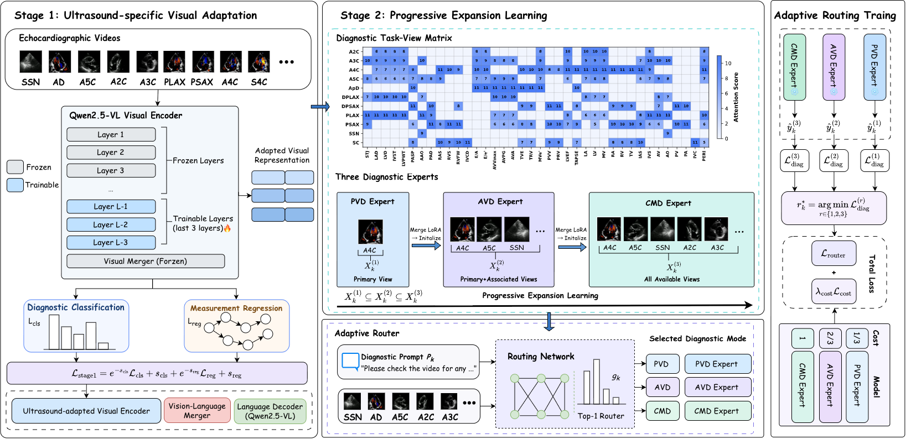

# Echo-View: Visual Domain Adaptation and Task-guided Multi-view Routing for Echocardiographic Diagnosis

Echo-View is a **two-stage vision-language framework** for structured echocardiographic diagnosis. Through **visual domain adaptation** and **task-guided multi-view routing**, the model dynamically selects the most appropriate combination of echocardiographic views for each diagnostic task, improving diagnostic performance while reducing redundant visual input. (This repository corresponds to the paper of the same name.)

## Core Idea

Echocardiographic diagnosis relies on dynamic cardiac information from multiple views, while **different diagnostic tasks often require different view inputs**. A fixed view combination either introduces redundant visual information or fails to fully exploit task-relevant views. The key contributions of Echo-View are:

- **Two-stage framework**: first visual domain adaptation, then task-guided specialized diagnosis
- **Progressive Expansion Learning**: progressively expanding view inputs from primary views to multi-view combinations
- **Task-guided Top-1 routing**: at inference, automatically selects the most suitable diagnostic mode based on the diagnostic prompt and input videos

## System Architecture



## Method Framework

### Stage 1: Visual Domain Adaptation
The visual encoder is adapted to echocardiography through the **joint supervision of diagnostic classification and quantitative measurement regression**, enabling it to extract more discriminative features from echocardiographic videos.

Corresponding module: `VISUAL_TRAIN/` (joint multi-task training with 28 binary classification + 7 regression tasks)

### Stage 2: Progressive Expansion Learning
Three diagnostic experts are trained with progressively expanding view input combinations:

| Expert | View Input | Description |
|---|---|---|
| PVD Expert | Primary-view | Primary views |
| MCD Expert | Main + Associated | Main and associated views |
| CMD Expert | Comprehensive | All views |

Corresponding module: `VLM_TRAIN/` (PVD / MCD / CMD LoRA fine-tuning)

### Inference: Task-guided Top-1 Routing
At inference, a **Top-1 routing module** selects the most appropriate diagnostic mode among the PVD / MCD / CMD experts based on the diagnostic prompt and input echocardiographic videos.

Corresponding modules: `MoE/` (multimodal routing) + `chat_moe.py`

## Dataset

Evaluated on a large real-world clinical dataset (see the paper):

| Statistic | Value |
|---|---|
| Echocardiographic reports | 453,211 |
| Unique patients | 383,750 |
| Echocardiographic video samples | 2,269,694 |

- Per-sample input: 1-6 echocardiographic videos plus a diagnostic question
- Videos are uniformly sampled online from `mp4` (16 frames x 224x224); train/val splits are patient-stratified to prevent leakage

## Experimental Results

Joint classification-and-regression supervision enhances the visual encoder's ability to extract diagnostic features from echocardiographic videos; the routing strategy further improves diagnostic performance while **reducing the amount of visual input**:

- **Mean AUC: 0.946**
- **Mean F1-score: 0.907**
- **Routing allocation**: 42.3% of tasks to PVD expert, 36.7% to MCD expert, 21.0% to CMD expert

These results show that the appropriate view input combination varies across diagnostic tasks and examinations, and Echo-View's routing strategy adaptively selects the optimal views for each task.

## Directory Structure

| Directory / File | Description |
|---|---|
| `DATA_BUILDER/` | Data construction: build VCR / PVD / MCD / CMD train/test JSON from raw DICOM videos |
| `VISUAL_TRAIN/` | **Stage 1** visual domain adaptation: joint classification + regression multi-task training (Qwen2.5-VL) |
| `VLM_TRAIN/` | **Stage 2** Progressive Expansion Learning: PVD / MCD / CMD three-expert LoRA fine-tuning (DeepSpeed) |
| `MoE/` | **Inference routing**: multimodal MoE routing module (text + multi-view videos, route to the corresponding expert) |
| `CMP_Model/` | Comparison baseline inference scripts (PanEcho / EchoPrime / Lingshu / Medgemma / HuatuoGPT-Vision / Gemma4 / Qwen2.5-VL / Qwen3-VL) |
| `chat.py` / `chat_moe.py` | Interactive diagnosis (direct Q&A / MoE routing) |
| `run_chat_moe.sh` | One-key diagnosis with MoE routing + expert Q&A |
| `run_train&eval.sh` | Batch training + evaluation |

## Environment

- Python 3.10, conda environment: `Qwen_back`
- Main dependencies: `torch`, `transformers`, `deepspeed`, `qwen-vl-utils`, `timm`, `decord`, `opencv-python`, `scikit-learn`, `pandas`, `pyyaml`
- Some configs use local absolute paths for base models and data; adjust the corresponding `*.yaml` / `*.sh` paths when running on another machine.

## Quick Start

### 1. Data Preparation (DATA_BUILDER)

```bash
cd DATA_BUILDER
# Build VCR / PVD / MCD / CMD train/test JSON from the Dataset
bash run_build_all.sh
```

### 2. Stage 1: Visual Domain Adaptation (VISUAL_TRAIN)

```bash
cd VISUAL_TRAIN
# Train: joint classification + regression multi-task on Qwen2.5-VL-7B-Instruct
bash run_train.sh <num_epochs> <unfreeze_layers>

# Predict: results in pred_output/
bash run_predict.sh
```

### 3. Stage 2: Progressive Expansion Learning (VLM_TRAIN)

```bash
cd VLM_TRAIN
# Launch LoRA fine-tuning in tmux (configure train_mode=PVD/MCD/CMD, GPU, batch_size via env vars)
bash run_train.sh

# Evaluate (PVD / MCD / CMD)
bash run_eval.sh
```

### 4. Routing System (MoE)

```bash
cd MoE
# Smoke test (validate dims / forward / loss)
python scripts/smoke_test.py

# Train the router
python train.py --config configs/default.yaml
```

### 5. One-key Diagnosis (Task-guided Routing)

```bash
# Top-1 routing + expert Q&A (reads an input JSON, outputs results in batch)
bash run_chat_moe.sh
```

### 6. Comparison Models (CMP_Model)

```bash
cd CMP_Model
# Toggle which models to run, e.g. PanEcho / EchoPrime / Qwen2.5-VL / Qwen3-VL ...
bash run_all.sh
```

## Citation

If you use this work, please cite the corresponding paper:

```bibtex
@article{echoview,
  title={Echo-View: Visual Domain Adaptation and Task-guided Multi-view Routing for Echocardiographic Diagnosis},
  note={Anonymous / under review}
}
```

## License / Notes

> This repository is for research purposes. Third-party model implementations embedded in subdirectories follow their respective declarations; large data and weight files are not uploaded with this repository (see `.gitignore`).
